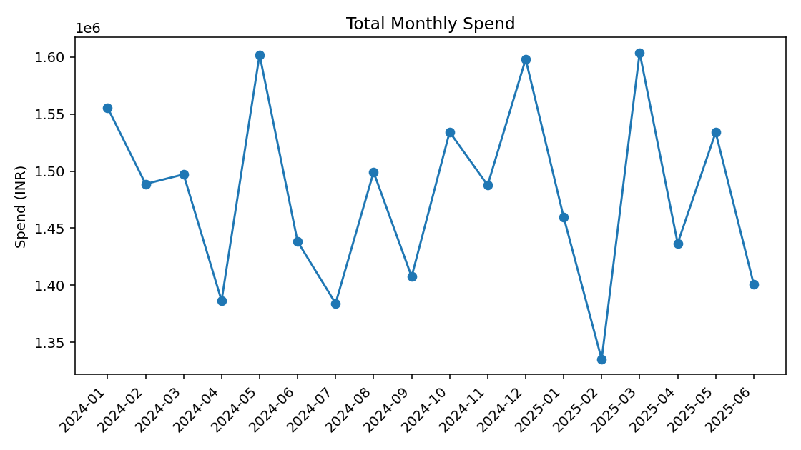
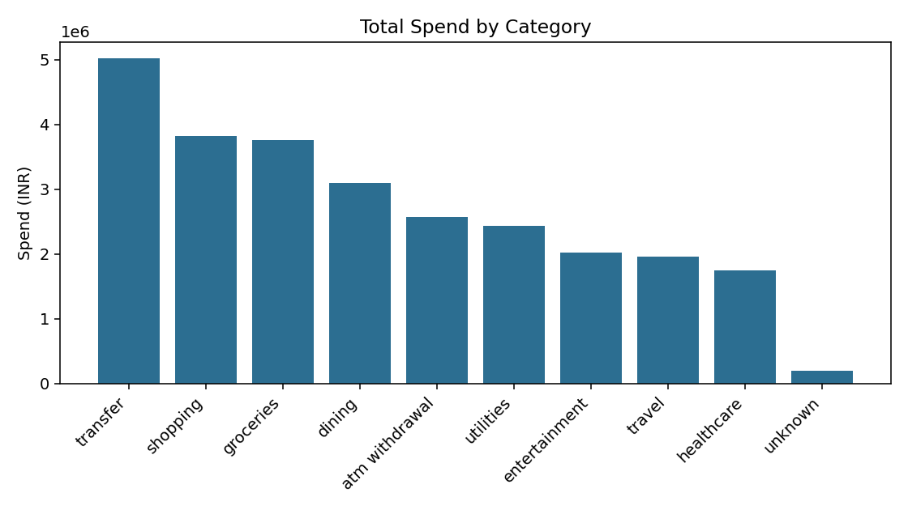

# Bank Transaction Analytics

SQL project on a customers/accounts/transactions dataset, built to sharpen my SQL for data analyst roles — joins, CTEs, window functions, and cleaning up genuinely messy data before analyzing it.

## About

Real banking transaction data isn't something you can just download for privacy reasons, so I generated a synthetic dataset instead: ~400 customers, ~470 accounts, ~20,000 transactions. I deliberately made it messy — duplicate rows, missing categories, inconsistent casing like `groceries` / `GROCERIES` / `Groceries` — so there was actual cleaning to do before the analysis meant anything.

## Tech stack

- SQLite
- Python (pandas, numpy, matplotlib) for generating the data and running the analysis
- Plain SQL for everything else

## Project structure

```
bank-transaction-analytics/
├── data/
│   ├── customers.csv, accounts.csv, transactions.csv   (raw)
│   └── bank.db
├── sql/
│   └── analysis.sql
├── scripts/
│   ├── generate_data.py
│   └── run_analysis.py
└── output/
    ├── *.csv
    └── *.png
```

## What's in analysis.sql

- **Cleaning view** (`transactions_clean`) — dedupes rows with `ROW_NUMBER()`, normalizes the messy category text
- **Joins** — customers → accounts → transactions for a per-customer spend summary
- **CTEs** — monthly spend-by-category aggregation, reused across a couple of queries
- **Window functions** — `LAG()` for month-over-month change, a running total via `SUM() OVER (... ROWS BETWEEN UNBOUNDED PRECEDING ...)`, and `RANK()` to rank customers by spend within their segment
- **City-level rollup** — the kind of summary a stakeholder would actually ask for
- **Basic anomaly flagging** — z-score style outlier detection per category

## How to run

```bash
pip install pandas numpy matplotlib
python scripts/generate_data.py     # builds data/bank.db
python scripts/run_analysis.py      # runs sql/analysis.sql, writes output/
```

## Sample output




## What I found

- Monthly spend bounces around in the ~1.33M–1.60M range with no clean single trend
- Groceries and Shopping are consistently the biggest categories
- ~25 transactions came back as statistical outliers (|z-score| > 3) within their category — the kind of thing worth a manual look in a real dataset
